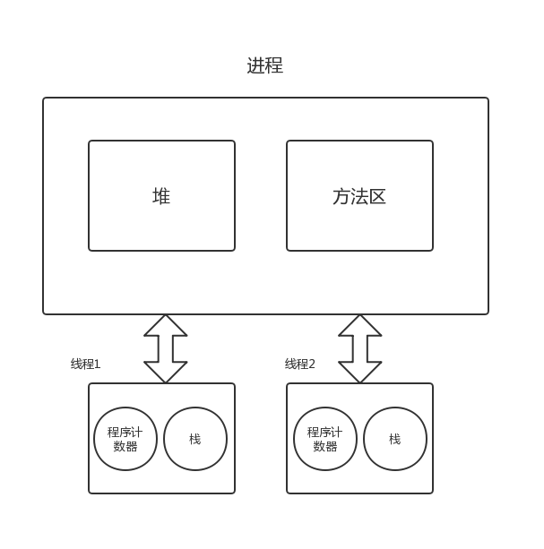

# 并发编程线程基础

[TOC]

## 线程和进程的区别

**进程**：代码在数据集合上的一次运行活动，是系统进行资源分配和调度的基本单位

**线程**：是进程的一个执行路径，线程本身不会独立存在，一个进程中至少有一个线程

在**分配资源**方面，**操作系统**是把**存储资源**分配给**进程**的，但**CPU资源**是分配到**线程**的，因为真正占用CPU的是线程，**线程**是CPU分配（计算资源）的基本单位。

启动一个Java程序时，JVM就是一个进程，而其中的main函数所在的线程就是这个进程中的一个线程，main函数的线程也称主线程。



多个线程共享同一进程的**堆**和**方法区资源**

**堆**主要存放使用new操作创建的对象实例。

**方法区**用来存放JVM加载的类、常量以及静态变量等信息。

每个线程有自己的**程序计数器**和**栈**。

**程序计数器**用来记录线程**当前**要执行的指令地址。

**栈**用来存该线程的局部变量（私有的）。


##  线程创建的3种方式

### 继承Thread类重写run方法

```java
public class Main {
    public static class MyThread extends Thread {
        @Override
        public void run() {
            System.out.println("I'm a thread");
        }
    }

    public static void main(String[] args) {

        // 创建线程
        MyThread thread = new MyThread();

        // 启动线程
        thread.start();
    }
}
```

上述代码通过继承`Thread`类，并重写`run`方法，实现了一个线程类。

使用线程时可以在`main`函数里创建一个`Mythread`实例后，并调用该实例的`start`方法启动线程。

**注意**：创建完`thread`对象后，该线程并没有被启动执行，`start`后才真正启动（需要等待CPU释放资源）。一旦`run`方法执行完毕，该线程就会终止。

### 实现Runnable接口的run方法

```java
public class Main {
    public static class RunnableTask implements Runnable {
        @Override
        public void run() {
            System.out.println("this is a thread");
        }
    }

    public static void main(String[] args) {

        // 创建线程任务
        RunnableTask task = new RunnableTask();

        // 启动线程执行任务
        new Thread(task).start();
        new Thread(task).start();
    }
}
```

由上述代码可以明显看出，使用实现接口`Runnable`并重写`run`的方式实际创造的是一个**任务**，不同于上一种方式继承`Thread`类创造的线程类。

如果需要执行这个**任务**，必须要通过`new`一个`Thread`对象来创造一个线程去`start()`，多个线程对象可以公用一个`task`代码。

通过实现`Runnable`接口的方式，在处理多个线程执行相同任务的问题时，具有一定的便利性。

### 使用FutureTask的方式

```java
public class Main {
    public static class CallerTask implements Callable<String> {
        @Override
        public String call() throws Exception {
            return "Hello";
        }
    }

    public static void main(String[] args) {
        // 创建异步任务
        FutureTask<String> futureTask = new FutureTask<>(new CallerTask());

        // 启动线程执行任务
        new Thread(futureTask).start();
        try {
            // 任务执行完毕，会收到一个返回值
            String result = futureTask.get();
            System.out.println(result);
        } catch (ExecutionException | InterruptedException e) {
            e.printStackTrace();
        }
    }
}
```

首先用类似`Runnable`的方式创建一个`CallerTask`任务类，实现`Callable`接口的`call()`方法。

在`main`函数中创建一个`FutureTask`对象，构造器输入`CallerTask`实例。创建一个线程`Thread`执行这个任务并启动，最后可以通过`futureTask.get()`方法**返回结果**。

### 三种方式对比

使用继承`Thread`的**好处**在于在`run()`中获取当前线程时只需要使用`this`就可以，不需要使用`Thread.currentThread()`方法。同时方便传参，可以在类中添加成员变量，通过`set`或构造函数的方式传递参数。`Runnable`方法只可以使用主线程中被声明为`final`的变量。

继承的**缺点**也很明显，Java的类只能继承一个类，如果继承了它，则不能继承其他的类。

`FutureTask`方法最大的不同点在于它可以取出任务的返回值。


